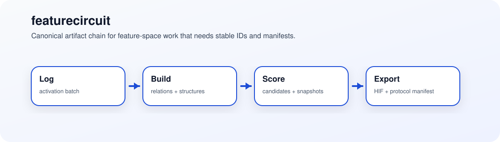

# featurecircuit
> Canonical artifact protocol for turning feature-space work into diffable, versioned, releaseable circuit-analysis outputs.

   

featurecircuit exists so circuit-analysis tools can compare artifacts without arguing about ad hoc IDs, file shapes, or missing lineage.



## 60-second demo
```bash
python -m venv .venv
source .venv/bin/activate
pip install --upgrade pip maturin pytest jsonschema pyyaml numpy
maturin develop --release -m core/py_nsi/Cargo.toml
cd demo
python python/demo3_spike_hypergraph.py
```

Produces a run under `demo/runs/` with protocol-native artifacts such as:
- `feature_space.v1.json`
- `relations.v1.json`
- `candidates.v1.json`
- `protocol_manifest.v1.json`
- `hypergraph.hif.json`

## Choose your path
- I want to ship artifacts: [60-second demo](#60-second-demo) · [Quickstart](#quickstart)
- I want to integrate a tool: [Canonical artifact chain](#canonical-artifact-chain) · [Repository faces](#repository-faces)
- I want to validate compatibility: [Tooling and validation](#tooling-and-validation) · [Status](#status)
- I want to contribute: [Roadmap](#roadmap) · [Contributing shape](#contributing-shape)

## Why this exists
Mechanistic interpretability repositories often agree on ideas and disagree on wire format. featurecircuit makes the artifact layer the product: versioned schemas, deterministic identifiers, manifests, validation, compatibility checks, and a reproducibility corridor that can be released and diffed.

## What this is / isn't
✅ Is: a protocol-and-tooling repo for feature spaces, relations, structures, candidates, snapshots, scores, and HIF export  
✅ Is: a consolidation point for earlier solver/demo trees  
❌ Isn't: only a dashboard repo or only a bindings repo  
❌ Isn't: a promise that all legacy APIs will remain forever

## Repository faces
- [`core/`](core/README.md): protocol contracts, stable IDs, Rust core, and Python bindings
- [`demo/`](demo/README.md): reproducibility corridor with scripts, configs, notebooks, and example outputs
- [`satellites/`](satellites/README.md): migrated companion modules that depend only on public interfaces
- [`legacy/`](legacy/superposition-demo/README.md): frozen historical surfaces kept for migration clarity

## Canonical artifact chain
```text
ActivationBatch
  -> FeatureSpaceDescriptor
  -> FeatureEventStream
  -> RelationArtifact
  -> StructureArtifact
  -> CandidateSetArtifact
  -> CircuitSnapshotArtifact
  -> ScoreBundleArtifact
  -> HIF Export / Report Artifact
```

## Quickstart
### Core + bindings
```bash
python -m venv .venv
source .venv/bin/activate
pip install --upgrade pip maturin pytest jsonschema pyyaml numpy
maturin develop --release -m core/py_nsi/Cargo.toml
python -c "import py_nsi; print('py_nsi OK')"
```

### Demo corridor
```bash
cd demo
python python/demo1_baseline.py
python python/demo2_ensemble.py
python python/demo3_spike_hypergraph.py
python python/demo4_causal.py
python python/demo5_dashboard.py
```

## Tooling and validation
- Rust tests: `cargo test --workspace`
- Python tests: `pytest -q tests`
- Schema validator: `python tools/schema_validate/main.py --path <artifact>`
- Artifact diff: `python tools/artifact_diff/main.py --left <a> --right <b>`
- Release preflight: `scripts/release_preflight.sh`

## API and compatibility
- Canonical Python surface: `py_nsi...`
- Temporary legacy bridge: `py_nsi.compat...`
- Compatibility manifests and schema versions live in [`docs/protocol.md`](docs/protocol.md)
- Migration details live in [`docs/migration.md`](docs/migration.md)

## Status
- This repo is the active canonical replacement for the older demo and solver repos.
- The consolidation release keeps a one-release compatibility bridge, not an indefinite freeze of old names.
- The protocol layer is the stable promise; implementation surfaces can still evolve.

## Roadmap
- Tighten external adopter guidance around manifests, compatibility, and export profiles.
- Expand conformance tests for downstream consumers.
- Retire temporary compat shims after the consolidation window closes.

## Contributing shape
Start in the right face before editing:
- protocol/schema changes belong under [`core/protocol/`](core/README.md)
- runtime or bindings changes belong under [`core/`](core/README.md)
- demo-corridor changes belong under [`demo/`](demo/README.md)
- satellites should stay behind the public boundary in [`satellites/`](satellites/README.md)

## License
[MIT](LICENSE)
